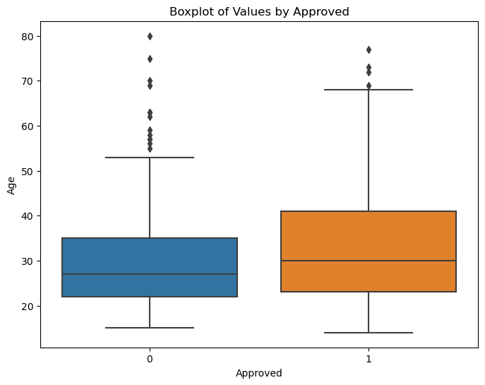
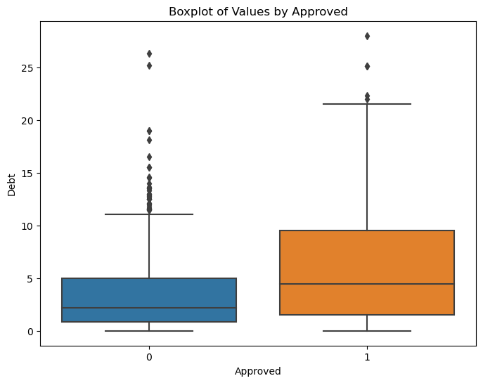
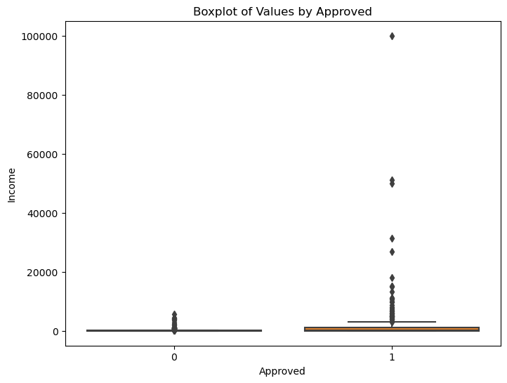
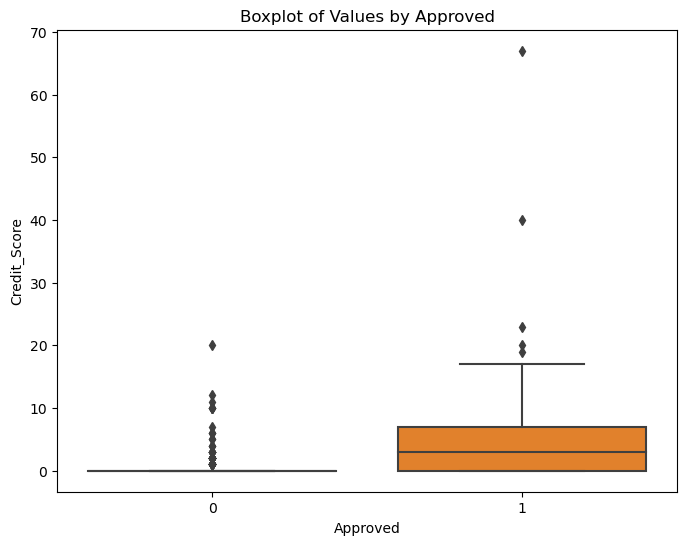
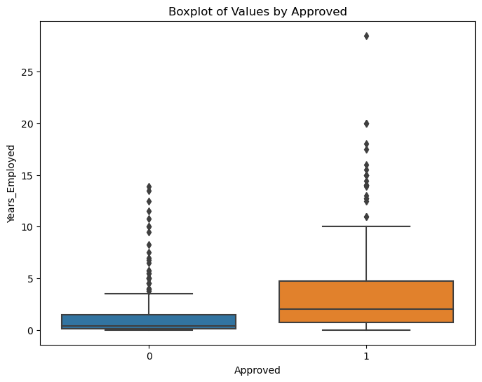
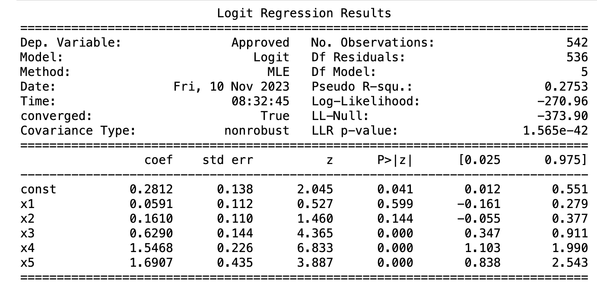

# Logistic Regression - Prediction of credit card approval

## Table of Contents
- [Problem Statement](#problemstatement)
- [Solution](#solution)
  - [Exploratory Data Analysis](#eda)
  - [Modeling](#modeling)
    - [Model1](#model1)
    - [Model2](#model2)
- [Conclusion](#conclusion)
- [Appendix](#appendix)

# Problem Statement

**Logistic Regression analysis and prediction of credit card approvals**

Companies have to go through a series of processes to approve a credit card for a person. This process is tedious and mundane. Every time an application is submitted bank has to analyze certain factors that play a vital role in the approval of the credit card, such as the income of the applicant, credit score, employment status, etc. This can be automated using Logistic regression analysis which can be used to understand the factors which have the most effect on the decision-making process of credit card approval. In order to achieve this, a logistic regression model can be trained to predict the probability of credit card approval based on the features from the data set. afterward, the trained logistic regression model can be analyzed to get insights into different features that have the highest impact on the approval rate.

# Solution

## Exploratory Data Analysis

We start off by understanding the type of data in the data frame. We can see from the below summary that there are 15 variables associated with credit card approval or denial. The outcome values of the last column approved are the following symbols, "+" means approved, and "-" means denied. These symbols are not meaningful, so we will be transforming them into 1's and 0's for the regression analysis.

There are five continuous variables in the dataset. We will check the relationship between these variables and credit card approval before jumping to regression analysis. A box plot is used here to understand the correlation between **Age_, Income, Debt, CreditScore, Years_Employed, and the approval rate**. The below box plots of these continuous variables show that the means of the features of the approved applications are further distributed from the mean of the denied.

**Relationship between Age and Credit Card approval**

**Relationship between Debt and Credit Card approval**

**Relationship between Income and Credit Card approval**

**Relationship between CreditScore and Credit Card approval**

**Relationship between Years Employed and Credit Card approval**

## Modeling

The next step is to perform logistic regression on the five variables identified from the dataset. The Akaike Information Criterion(AIC) value tells us the quality of our model. A summary of the regression can be used to interpret the factors that have a significant influence on the approval of a credit card application.

To effectively evaluate the regression model trained, the dataset needs to be partitioned as train and test data. 80% of the dataset is used for training and the rest is used to predict the credit card application approval. The confusion matrix tells us how accurate the prediction is.

### Model1

The confusion matrix above gives the actual values and predicted values. 75 is the number of credit card applications correctly predicted as denied out of 93 (80.65% accuracy) and 38 is the number of applications correctly predicted as granted out of 43 (93.75% accuracy). The rest are Type 1 and Type 2 errors in the prediction. Approximately, the model is 75.28% accurate in predicting credit card approval.

We develop a multiple regression equation using __Age, Debt, Years_Employed, Credit_Score, and Income__ to predict credit card approval and check how well the regression model explains the variability in credit card approval.

$Log odds of Approval = 0.0591*Age + 0.1610*Debt + 0.6290*Years_Employed + 1.5468*Credit_Score + 1.6907*Income + 0.2812$

From the summary of the regression model, we can see that __YearsEmployed_, _CreditScore_, and _Income__ have a high significance in predicting credit card application approval or denial. These factors are significant with a __p-value__ of 0.000. Other features like __Age and Debt__ do not seem to have much significance in predicting the approval of credit card applications because the __p-value__ is much higher for these features.

The Pseudo $R^2$ value of the model is __0.2753__ and the log-likelihood of the fitted model is __-270.96__, that means the deviance for the model is **−2×(−270.96)=2×270.96=541.92**. The log-likelihood of the null model which is __-373.90__, which means the deviance for the model is **−2×(−373.90)=2×373.90=747.80.** This suggests that  the goodness of fit is higher when we include the predictors in the regression model. 

From this model, we found that only three factors have a significant influence on predicting approval rate. So in the next step, we will perform another regression model by removing the least significant features such as Age and Debt from the model and analyze the difference in diviance and other factors.

### Model2

